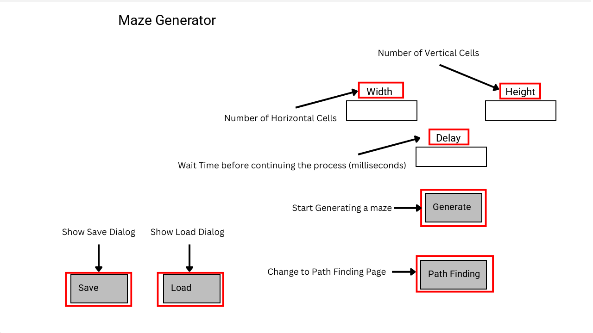
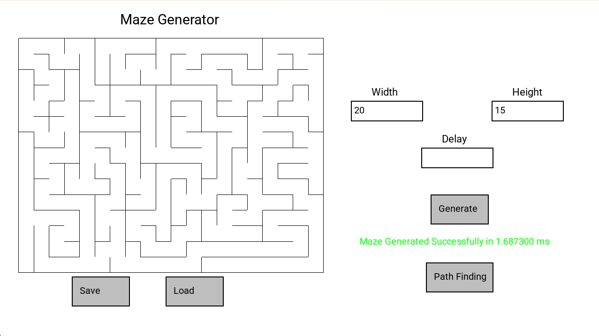
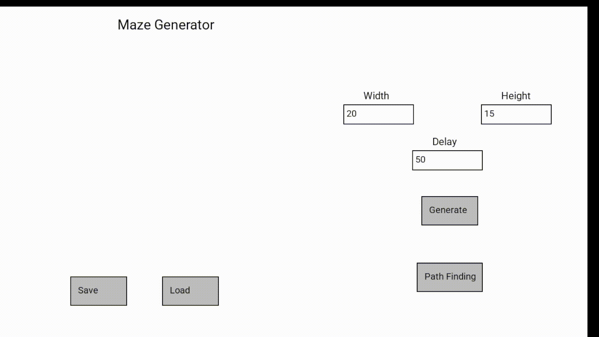
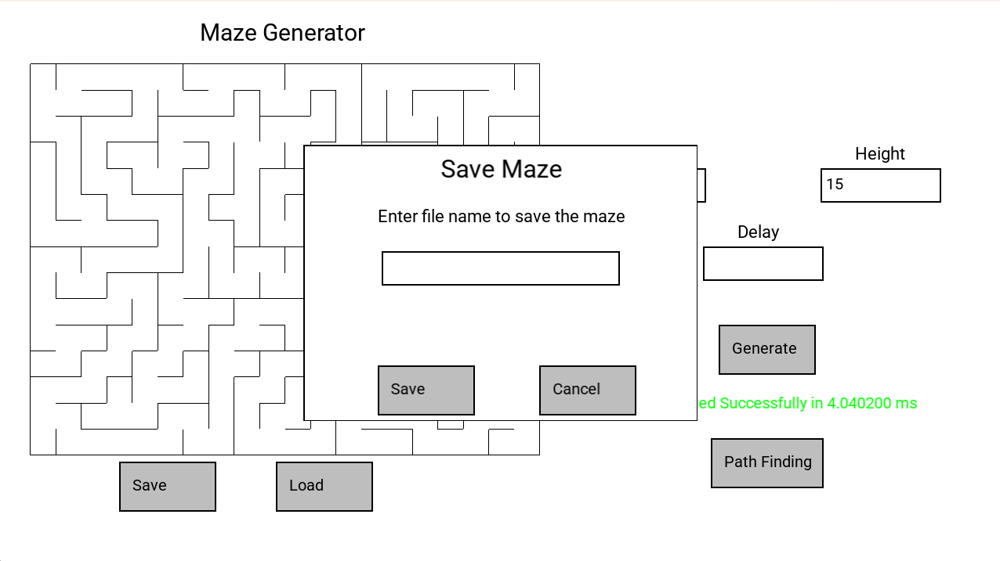
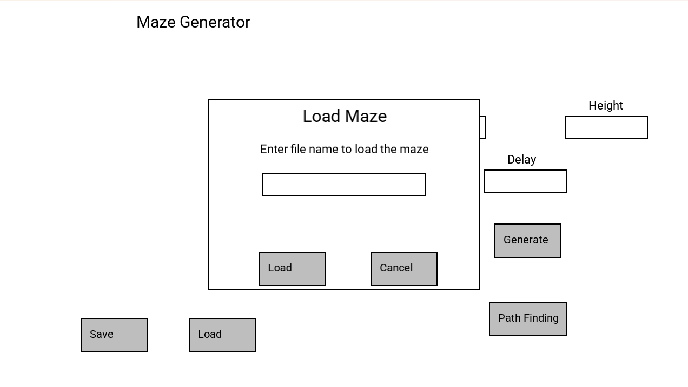

# Maze Generator
A program written in C++ to generate a maze using Radomized Depth-First Search (DFS) algorithm, and find the shortest path from a selected cell to another selected cell using Breadth-First Search (BFS) algorithm.

# Manual
## Maze Generator Page

When you first open the program, you'll be in maze generator page

## Generate Without Delay

If you don't input anything to delay or input 0. Maze will be generated as fast as possible then show the result without visualizing the process

## Generate With Delay

If you do input delay maze will start generating and visualizing the process. The delay means wait time in milliseconds before continuing the process. The more the delay the slower the process

- Blue represents a cell at the top of the stack
- Yellow represents visited cells
- Green represents dead-end cells

## Save Maze

After a maze has been generated successfully, you'll be able to click Save button to save the generated maze

Enter only a filename then click save, and your .maze file will be saved at the same directory as your built program

**Warning:** If a maze file with the name you've input already exists, that file will be replaced by a new file that you've just saved

## Load Maze

If the maze is not being generated, you can click the Load button to load a maze that you've saved

Enter only a filename then click load, and the maze will be loaded and showed in the program

**Note:** your maze file needs to be in the same directory as the program in order to load